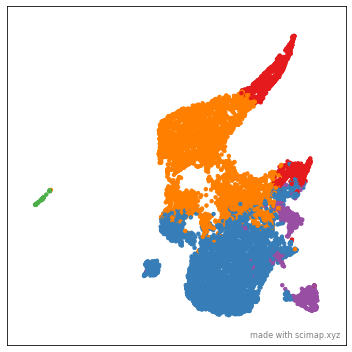
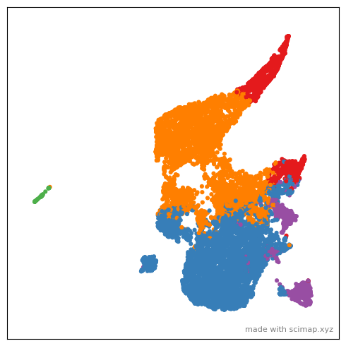
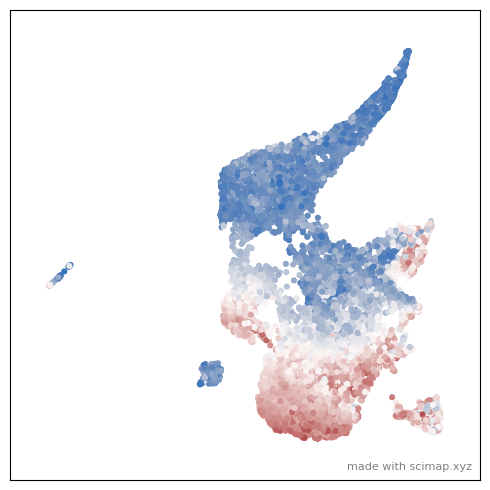
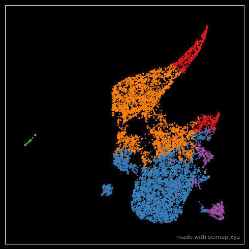

```python
# 31 May 2022
# Animate UMAP with SCIMAP
# Ajit Johnson Nirmal
```

## Preparing Data

The objective is to create an animation showing transition between UMAP plot and XY coordinate plot in spatial data.

Let us use the same data that we used in the [previous tutorial](https://dataverse.harvard.edu/dataset.xhtml?persistentId=doi:10.7910/DVN/98WEMD).


```python
# Let us start off with importing scimap
import scimap as sm
```


```python
# let us import the same data that we using the previous tutorial
# Check out the previous tutorial for details
common_path = "/Users/aj/Dropbox (Partners HealthCare)/conferences/scimap_tutorial/may_2022_tutorial/"
adata = sm.pp.mcmicro_to_scimap (feature_table_path= str(common_path) + 'exemplar_001/quantification/unmicst-exemplar-001_cell.csv')

```

    Loading unmicst-exemplar-001_cell.csv


All you need to be aware of is that you would need the XY coordinates in `adata.obs`. Check out the first two columns below. 


```python
adata.obs.head(3)
```


<div>
<style scoped>
    .dataframe tbody tr th:only-of-type {
        vertical-align: middle;
    }

    .dataframe tbody tr th {
        vertical-align: top;
    }

    .dataframe thead th {
        text-align: right;
    }
</style>
<table border="1" class="dataframe">
  <thead>
    <tr style="text-align: right;">
      <th></th>
      <th>X_centroid</th>
      <th>Y_centroid</th>
      <th>Area</th>
      <th>MajorAxisLength</th>
      <th>MinorAxisLength</th>
      <th>Eccentricity</th>
    </tr>
  </thead>
  <tbody>
    <tr>
      <th>unmicst-exemplar-001_cell_1</th>
      <td>1768.330435</td>
      <td>257.226087</td>
      <td>115</td>
      <td>12.375868</td>
      <td>11.823117</td>
      <td>0.295521</td>
    </tr>
    <tr>
      <th>unmicst-exemplar-001_cell_2</th>
      <td>1107.173913</td>
      <td>665.869565</td>
      <td>92</td>
      <td>11.874070</td>
      <td>9.982065</td>
      <td>0.541562</td>
    </tr>
    <tr>
      <th>unmicst-exemplar-001_cell_3</th>
      <td>1116.290323</td>
      <td>671.338710</td>
      <td>62</td>
      <td>9.995049</td>
      <td>8.673949</td>
      <td>0.496871</td>
    </tr>
  </tbody>
</table>
</div>


We already have one of the coordinate systems in place (i.e. the XY system). Let us generate the other coordinate system. We are going to perform `UMAP` but you can use any other method such as `PCA` or `TSNE` etc...


```python
# Run UMAP in scimap
adata = sm.tl.umap (adata)
```

    OMP: Info #270: omp_set_nested routine deprecated, please use omp_set_max_active_levels instead.


```python

```

If you are interested to know where the umap results are stored, it is in `adata.obsm`. 
You might also need to know this if you plan to pass in your custom coordinate systems. You could save your custom coordinates as a 2D array in `adata.obsm` and call it in the `sm.hl.animate()` function


```python
# take a sneek peek at the UMAP results
adata.obsm['umap']
```


    array([[ 5.8368936,  5.994031 ],
           [ 7.6336074,  8.640663 ],
           [ 7.0792394,  8.212058 ],
           ...,
           [ 9.53943  , 11.315233 ],
           [ 8.265402 , 12.259403 ],
           [ 5.8973293,  6.0002956]], dtype=float32)


Now that we are set with both the coordinate systems can create the animation. However, it may be still a bit dull as we do not have intersting way to color the plot. 
A common way to color a plot is by its cell-types. As I had showed previously, you could use scimap's [cell phenotyping](https://scimap.xyz/tutorials/2-scimap-tutorial-cell-phenotyping/) method to identify cell types. For simplicity let us cluster the data and color by those clusters.


```python
# Perform k means clustering with k=5 and save the results in a column called kmeans
adata = adata = sm.tl.cluster (adata, k= 5, method = 'kmeans', label='kmeans')
```

    Kmeans clustering


```python
# check results
adata.obs['kmeans'].value_counts()
```


    1    5050
    4    4345
    0     996
    3     703
    2      76
    Name: kmeans, dtype: int64


As you can see above we have identified 5 clusters.

## Time for Animation

Here is the [documentaion](https://scimap.xyz/All%20Functions/D.%20Helper%20Functions/sm.hl.animate/) for all the parameters that are available within the `animate` function. Something to keep in mind is that not all IDE's are able to render the animation and so I highly recommend saving the animation to disk before viewing it. As saving takes quiet a long time, I generally optimize the look of the animation by subsampling the data. Sometimes `jupyter notebook` just renders a still image and so that might also help with optimization. 


```python
sm.hl.animate (adata, color='kmeans')
```


    

    


Let us now save the animation to disk. In order to save the animation you would need something called `imagemagick` installed on your computer. Please [follow this link](https://imagemagick.org/script/download.php) to install it. 

To save the animation to your disk pass, the path to the location, along with the file name like so: `save_animation = "/path/to/directory/my_figure"`


```python
sm.hl.animate (adata, color='kmeans',
               save_animation = '/Users/aj/Downloads/test')
```

    Saving file- This can take several minutes to hours for large files


    

    

You might notice that the `gif` images are quiet large. I will add supoort to saving as `mp4` soon. 
I generally use some online tool to convert it to `mp4` for reducing the file size. 


There are a number of `parameters` to play around with to customize the look of the animation. Check out the documentation for more details.
```
palette=None, 
subset=None, subsample=None,
use_layer=None, use_raw=False, log=False, 
n_frames=50, interval=50, reverse=True, final_frame=5, 
s=None, alpha=1, cmap='vlag', tight_layout=True, 
plot_legend=False, title=None, fontsize=20, pltStyle=None,
figsize=(5, 5)
```

Please note you can only plot one image at a time as in most cases the XY are unique to each image. If you are working with a dataset with multiple images, please use the `subset` parameter to subset the **one** image that you want to plot. As I mentioned earlier use the `subsample` parameter to optimize the feel of the plot. 

You could also `color` the plot by expression of a particular marker by using and these parmaters control different aspects of it `use_layer=None, use_raw=False, log=False` 


```python
sm.hl.animate (adata, color='CD45')
```


    

    


Use `n_frames=50, interval=50, reverse=True, final_frame=5` to control the smoothness and duration of the animation. You can also change the theme/ background of the plot using the `pltStyle=None` paramater. 


```python
sm.hl.animate (adata, color='kmeans', pltStyle='dark_background', s=1)
```


    


Note that I have changes the dot size with `s=1` in the above plot. If you think that is still large, increase 
the size of the entire figure using `figsize = (25,25)` which will retrospectively make the points smaller. 
    


#### Happy Animating. 

I would love to see what you create. Tag me on [twitter](https://twitter.com/ajitjohnson_n).
